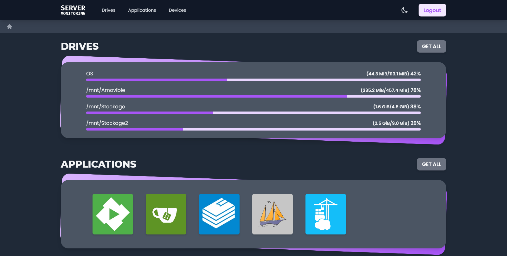
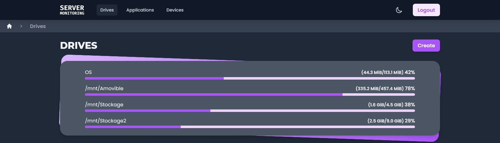
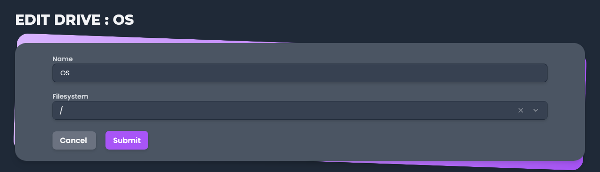
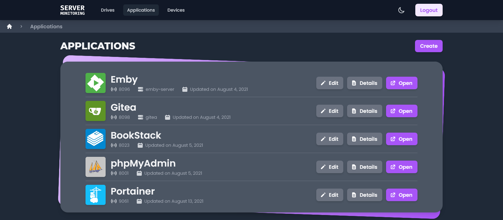
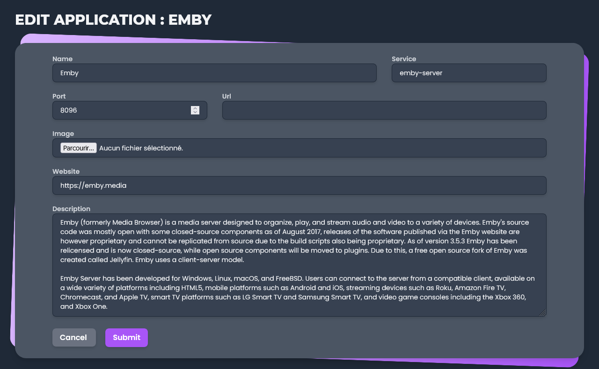
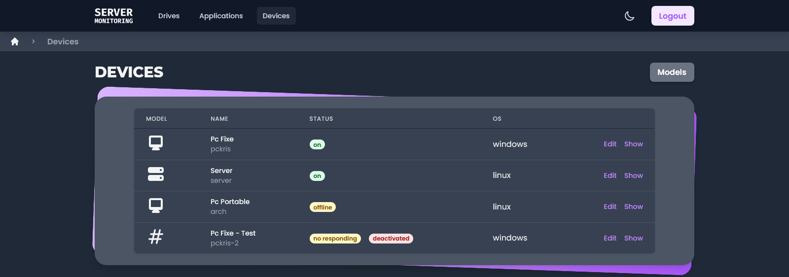
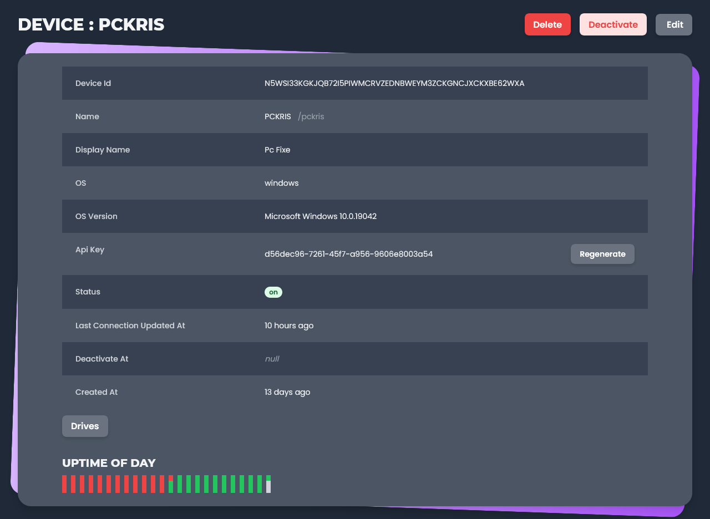
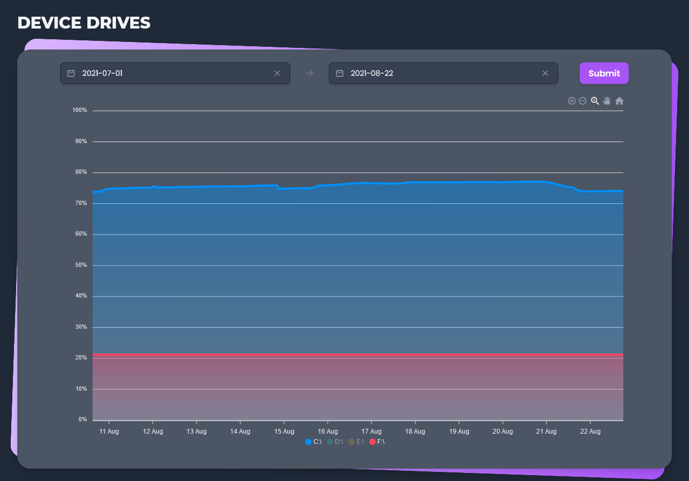
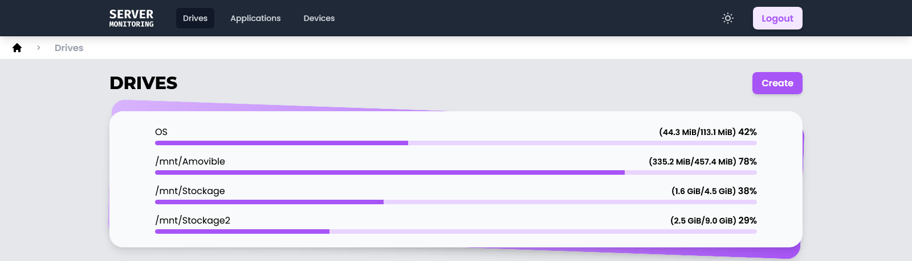
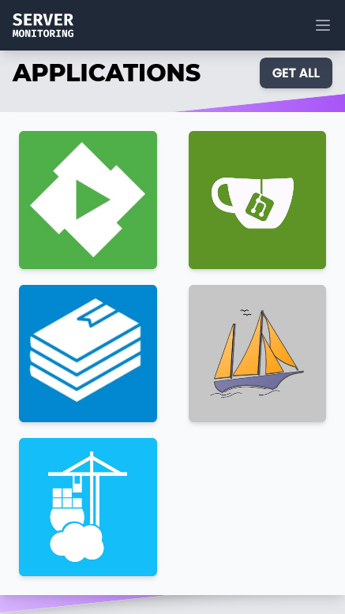

[![MIT License][license-shield]][license-url]
[![LinkedIn][linkedin-shield]][linkedin-url]

<h1 align="center">
	<b>SERVER MONITORING</b>
	<br />
	<small align="center">Front End</small>
</h1>

<details open="open">
  <summary>Table of Contents</summary>
<!-- TOC depthfrom:1 -->

-   [About The Project](#about-the-project)
    -   [Features](#features)
        -   [Drives](#drives)
        -   [Applications](#applications)
        -   [Devices](#devices)
        -   [Other](#other)
    -   [Build with](#build-with)
-   [Getting Started](#getting-started)
    -   [Prerequisites](#prerequisites)
    -   [Installation](#installation)
-   [Roadmap](#roadmap)
-   [License](#license)
-   [Contact](#contact)

<!-- /TOC -->
</details>

## About The Project

Web application allowing to have information on a server, with the possibility to add links to local web servers and services (Front End).

-   [Back End](https://github.com/KristenJestin/server-monitoring-back)
-   [Service Worker](https://github.com/KristenJestin/server-monitoring-service-worker)



### Features

#### Drives

The application allows to display all the hard disks and their usage (via percentages).



The server retrieves all available disks. Via forms, it is possible to give them a different name.



#### Applications

It is possible to add applications that are present on the server. It is enough to provide a name, a logo and a port.





Additional information is requested such as the service. This allows to have information on the state of the service.


#### Devices

All the devices present on the local network can be registered in the application to have a status.



This part works mainly with the [service worker](https://github.com/KristenJestin/server-monitoring-service-worker). This one is installed on a machine (Windows or Linux) and sends HTTP requests every x minutes to warn the server that it is still active.



Every x hours, the worker service sends information about the hard drives. This allows to have a graph of the evolution of the use.



#### Other

-   The application has an authentication system.
-   The application has a dark and light mode.
    -   
-   The application is responsive.
    -   
-   The application is partially containerizable (Docker).

### Build with

-   [Vue 3](https://v3.vuejs.org/)
-   [Tailwind CSS](https://tailwindcss.com/)
-   [InertiaJs](https://inertiajs.com/)
-   [TypeScript](https://www.typescriptlang.org/)
-   [ViteJs](https://vitejs.dev/)

## Getting Started

### Prerequisites

-   [NodeJs](https://nodejs.org/)

### Installation

1. Install the Back end part [Server Monitoring - Front end](https://github.com/KristenJestin/server-monitoring-back#installation)
2. Clone the repo
    ```sh
    git clone https://github.com/KristenJestin/server-monitoring-front.git
    ```
3. Install packages
    ```sh
    yarn install
    ```
4. Start the Back end part

## Roadmap

All future features are available on [Trello](https://trello.com/b/5A8iO3Xc/%F0%9F%93%8A-server-monitoring).


## License

Distributed under the MIT License. See `LICENSE` for more information.

<!-- CONTACT -->

## Contact

Kristen JESTIN - [contact@kristenjestin.fr](mailto:contact@kristenjestin.fr)

Project Link: [https://github.com/KristenJestin/server-monitoring-front](https://github.com/KristenJestin/server-monitoring-front)

<!-- MARKDOWN LINKS & IMAGES -->

[license-shield]: https://img.shields.io/github/license/KristenJestin/server-monitoring-front.svg?style=for-the-badge
[license-url]: https://github.com/KristenJestin/server-monitoring-front/blob/master/LICENSE
[linkedin-shield]: https://img.shields.io/badge/-LinkedIn-black.svg?style=for-the-badge&logo=linkedin&colorB=555
[linkedin-url]: https://linkedin.com/in/kristen-jestin
